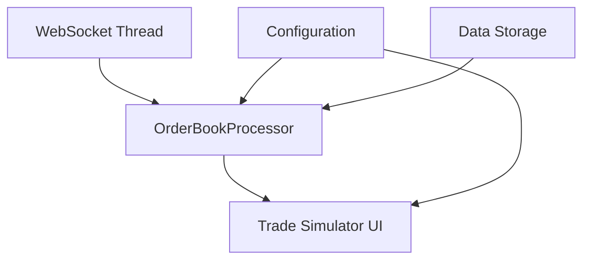

# GoQuant Trade Simulator Architecture

## System Overview

The GoQuant Trade Simulator is built using a modular architecture that separates concerns into distinct components. The system follows a Model-View-Controller (MVC) pattern with real-time data processing capabilities.

## Component Architecture



## Core Components

### 1. WebSocket Thread (`websocket_thread.py`)
```python
class WebSocketThread(QThread):
    data_received = pyqtSignal(dict)
    latency_updated = pyqtSignal(float)
    
    def __init__(self, url):
        super().__init__()
        self.url = url
        self.connection_active = False
        self.running = True
        
    def run(self):
        while self.running:
            try:
                # WebSocket connection logic
                ws = websocket.WebSocketApp(
                    self.url,
                    on_message=self.on_message,
                    on_error=self.on_error,
                    on_close=self.on_close
                )
                ws.run_forever()
            except Exception as e:
                print(f"WebSocket error: {e}")
                time.sleep(5)  # Reconnection delay
```

### 2. Order Book Processor (`processor.py`)
```python
class OrderBookProcessor:
    def __init__(self):
        self.asks = []
        self.bids = []
        self.timestamp = ""
        self.exchange = ""
        self.symbol = ""
        
    def update_orderbook(self, data):
        """Updates internal order book state with new data"""
        self.timestamp = data["timestamp"]
        self.exchange = data["exchange"]
        self.symbol = data["symbol"]
        self.asks = [[float(price), float(size)] for price, size in data["asks"]]
        self.bids = [[float(price), float(size)] for price, size in data["bids"]]
```

### 3. UI Components (`ui.py`)
```python
class TradeSimulatorUI(QMainWindow):
    def __init__(self):
        super().__init__()
        self.setWindowTitle(WINDOW_TITLE)
        self.setMinimumSize(WINDOW_MIN_WIDTH, WINDOW_MIN_HEIGHT)
        
        # Initialize components
        self.processor = OrderBookProcessor()
        self.ws_thread = WebSocketThread(WS_URL)
        
        # Set up UI
        self.setup_ui()
```

## Data Flow

1. **Data Ingestion**
   - WebSocket connection to exchange
   - Real-time order book updates
   - Latency monitoring

2. **Data Processing**
   - Order book state management
   - Slippage calculation
   - Fee computation
   - Market impact estimation

3. **UI Updates**
   - Real-time visualization
   - User input handling
   - Performance metrics display

## Configuration Management

The system uses a centralized configuration approach:

```python
# config/settings.py
WINDOW_TITLE = "GoQuant Trade Simulator"
WINDOW_MIN_WIDTH = 800
WINDOW_MIN_HEIGHT = 600

# API Configuration
WS_URL = "wss://ws.okx.com:8443/ws/v5/public"

# Fee Structure
MAKER_FEE = 0.001
TAKER_FEE = 0.002

# Volume Discounts
VOLUME_DISCOUNTS = {
    1000000: 0.2,  # 20% discount for > $1M
    500000: 0.1,   # 10% discount for > $500K
    100000: 0.05   # 5% discount for > $100K
}
```

## Error Handling

The system implements comprehensive error handling:

1. **WebSocket Errors**
   - Automatic reconnection
   - Connection state monitoring
   - Error logging

2. **Data Processing Errors**
   - Input validation
   - Exception handling
   - Graceful degradation

3. **UI Errors**
   - User feedback
   - Error recovery
   - State preservation

## Performance Considerations

1. **Memory Management**
   - Efficient data structures
   - Garbage collection optimization
   - Resource cleanup

2. **CPU Optimization**
   - Asynchronous processing
   - Batched updates
   - Caching strategies

3. **Network Optimization**
   - WebSocket connection pooling
   - Data compression
   - Latency monitoring

## Security Measures

1. **Data Security**
   - Input sanitization
   - Data validation
   - Secure WebSocket connection

2. **Error Prevention**
   - Input validation
   - State verification
   - Exception handling

## Testing Strategy

1. **Unit Tests**
   - Component testing
   - Function validation
   - Edge case handling

2. **Integration Tests**
   - Component interaction
   - Data flow verification
   - System behavior validation

3. **Performance Tests**
   - Load testing
   - Stress testing
   - Latency measurement

## Deployment Considerations

1. **System Requirements**
   - Python 3.8+
   - Required dependencies
   - Hardware specifications

2. **Configuration**
   - Environment setup
   - API configuration
   - System parameters

3. **Monitoring**
   - Performance metrics
   - Error tracking
   - Resource utilization 